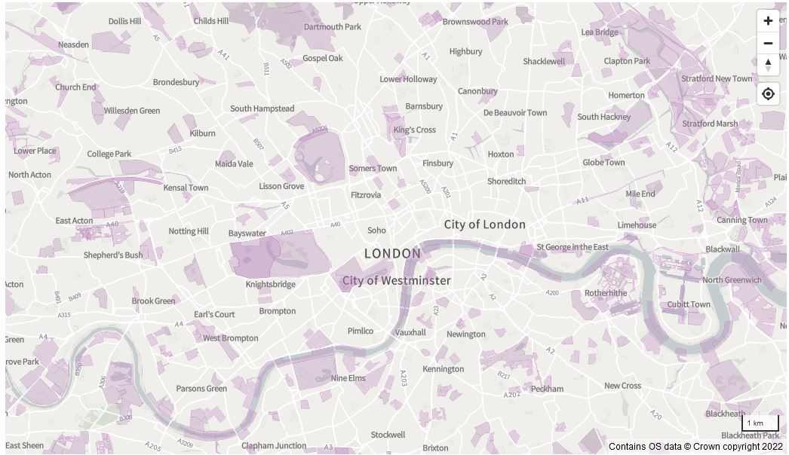

# Analysis of land ownership data in England and Wales

Inspired by the book and blog [Who Owns England](https://whoownsengland.org/) this repository contains an analysis of [Land Registry data](https://use-land-property-data.service.gov.uk/) about land ownership in England and Wales.

The code focuses on two main objectives:

1. Making the INSPIRE polygons more accessible
2. Geocoding the UK and Oversees ownership data

<a href="https://mem48.github.io/LandOwnership/">View the interactive map</a>

You can see the work in progress map using the link above, or read the explination of the data and methods below. All the R code is available in this Repo.

## Mapping the INSPIRE polygons

The [INSPIRE polygons](https://www.gov.uk/guidance/inspire-index-polygons-spatial-data) show the freehold land in England and Wales. They are published as Open Data with a few [conditions](https://use-land-property-data.service.gov.uk/datasets/inspire#use_the_data). But as you might imagine, every parcel of land in England and Wales is a massive dataset, so it is not that easy to actually use. There was a [viewing service](https://www.data.gov.uk/data/map-preview?e=1.74944&n=60.8433&s=49.9553&url=http%3A%2F%2Finspire.landregistry.gov.uk/inspire/ows?Service=WMS&Request=Getcapabilities) but it has now been disabled and was pretty awful anyway.

So the first task was to build a modern vector tile set for INSPIRE polygons. I also decided to do some light cleaning of the data.

### Cleaning the polygons
Land registry maps are often digitised versions of old paper maps. Therefore the titles are often split into grids where a property crosses the boundary of one paper map to another. I wrote code to detect straight edges that align with the 500m grids of the British National Grid and remove them. 

<figure>

<figcaption align = "center">
<b> Polygon boarders aligned with the grid have been detected and highlighted in red.</b>
</figcaption>
</figure>

   
While this is not perfect, the INSPIRE Polygon data is very messy, it does help clean up the data and make it clearer where large titles are.

Once the polygons have been cleaned, and duplicates have been removed, each Local Authority's data can be combined into a single 24 GB geojson. I also created smaller files containing just the polygons greater than 100 acres and 10 acres.

I then built these into a tileset. As showing all the polygons in the country is not possible even for Vector Tiles, I chose to map the large polygons when zoomed out and then add smaller polygons the closer you zoom.

<figcaption align = "center">
<b>When zoomed out only the largest polygons are shown</b>
</figcaption>

<figure>

<figcaption align = "center">
<b>Zoom in a little and you can see all the polygons</b>
</figcaption>
</figure>

   
  
You can also click on the polygons so see the INSPIRE ID which can be used to [purchase the full title](https://search-property-information.service.gov.uk/search/search-by-inspire-id) the Local Authority name and the area in square metres. Due to an oversight on my part the area is given to 13 decimal places, I'll fixe this in a future version.

Also as I have merged some polygons, some INSPIRE IDs are missing. For merged polygons they have been given on of the INSPIRE IDs from the unmerged polygons, but which one they get is essentailly random. 

## Geocoding the UK and Oversees ownership data

While the INSPIRE polygons are great for viewing, they contain no information about who owns the land. However, the Land Registry published two datasets that explicitly name the owners of the land. The [UK companies that own property in England and Wales](https://use-land-property-data.service.gov.uk/datasets/ccod) and the [Overseas companies that own property in England and Wales](https://use-land-property-data.service.gov.uk/datasets/ocod). Anna Powell-Smith has already mapped this data [here](https://whoownsengland.org/2017/11/14/the-companies-corporate-bodies-who-own-a-third-of-england-wales/) and [here](https://www.private-eye.co.uk/registry).

But there are a few limitations to her implementation.

1. The data is now a few years old
2. The geo-location appears to be postcode-based.
3. Properties without a postcode are missing.
4. Multiple properties in one title are excluded.

So we can do much better.

This is in no way criticism of Shrubsole and Powell-Smith's excellent work. But I suspect it is a simply case of the limited resources available to them. In contrast, academics get privileged access to data and resources, which sometimes go unused. In this case, I have an enterprise-grade workstation that is usually off on evenings and weekends. So I throw vastly more compute power at the problem for essentially zero cost.

### Challenges in Geocoding

Let us look at an example of the data. The UK Company ownership data has a lot of information. Still, for geocoding purposes, there are only a few key variables.

|Property Address	| AdminDistrict |	PostalCode|
| --- | --- | --- |
|5 West Park, Bristol (BS8 2LX) |	CITY OF BRISTOL	| BS8 2LX|

As far as I can tell, Powell-Smith's method was to use OpenStreetMap to geocode the postcode, and then slightly randomise the positions of the results to account for multiple addresses at the same postcode. This is fine for this example, the point on the map is close to the actual address, and it is reasonably clear what the point refers to.

But consider another example:

*1-4 Crown Row, Bracknell (RG12 0TH), 3, 14, 17, 18, 21, 26, 29, 31, 45, 49, 50, 55-70, 74, 75, 77-81, 84, 85, 91-95, 101, 103, 104, 106, 110, 111 Dalcross, Bracknell (RG12 0UJ), 71-73, 76, 82, 83, 86, 87 Dalcross, Bracknell (RG12 0UL), 1, 6, 9, 11 Fencote, Bracknell (RG12 0TD), 6, 8, 9, 12, 19, 22, 25, 47, 50 Garswood, Bracknell (RG12 0TY), 52, 60, 61, 65, 67, 80 Garswood, Bracknell (RG12 0TZ), 2, 10, 14, 16, 18, 36, 40, 42-44, 58-60, 72, 76, 79, 80 Helmsdale, Bracknell (RG12 0TA), 12, 13, 15, 45, 64-67, 82, 86, 87, 96, 97-99, 108, 112-115, 118, 126, 129, 138 Helmsdale, Bracknell (RG12 0TB), 1, 6, 11, 15, 23, 24, 28, 32, 33, 42-51, 67, 68, 72, 79, 80 Keepers Coombe, Bracknell (RG12 0TW, 10, 12-14, 21, 22, 25-27, 29-31, 34-36, 41 Keepers Coombe, Bracknell (RG12 0TN), 1-9, 21, 22, 26, 27, 31, 32 Kimmeridge, Bracknell (RG12 0UD), 86, 89-93(odd), 94, 100, 102, 107, 122, 125 Leaves Green, Bracknell, (RG12 0TE), 1-6, 8-10, 13-26, 33, 34, 48-50, 54, 58, 59, 63-80 Leaves Green, Bracknell (RG1*

In this case, this title is also given a single postcode (RG12 0TH) and a single dot on the map. One dot does not clearly convey the extent of this land ownership. But it is possible to parse this into 233 unique addresses that the text refers to. In this case, I expect that the title covers even more addresses as there are several titles that cut off mid-postcode at 999 characters, which suggests they have been truncated at some point. Nevertheless identifying the knowable 233 addresses helps improve our understanding of land ownership even if it is incomplete.

Splitting these text strings into unique addresses was no mean feat as the `Property Address` field is essentially free text full of different styles and spelling errors. Notice things like `89-93(odd)`, a common way to refer to a range of numbers. The trick is first to standardise the text by correcting spelling errors and removing muliple ways to say the same thing, e.g. `(odd),(odds),(odd numbers)`. We can then split the text at each postcode and when there are long strings of text (most likely road names). For this, I need to give full credit to ctwheels for his [stack overflow answer](https://stackoverflow.com/questions/164979/regex-for-matching-uk-postcodes
) on the correct regex to detect a UK postcode.

While this kind of text parsing is never 100% successful, it is worth doing. For example, I found 9,034 freehold titles that contained multiple postcodes. But when they were broken up, they actually held 168,911 unique property addresses. This shows the problem with mapping each title, it biases the map towards companies that own single properties and hides companies that own whole streets. 

So far, I've only looked at the freehold titles and because of the messy structure, I've had to split them up into categories.

|Type	| Number of Titles |	Number of Addresses |
| --- | --- | --- |
|Singe postcode and a short property address |	1,431,806	| 1,776,987|
|Singe postcode and a long property address |	124,347| 456,337 addresses and 2,316 titles too complex to parse|
|Multiple postcodes |	9,034 | 168,911|
|Land with a postcode |	122,00| To do|
|Address without a postcode |	477,000 | 1,830,024 addresses and 111,191 titles too complex to parse, (mostly electrical substations)|
|Land without a postcode |	878,000	| To do|

Some of these are easier to work with than others. The 1.77 million simple addresses are easy to pass through a geocoder. But the "land" categories are harder. However, there are still opportunities. For example, many of the "land" titles are in the form of `address and associated land` in these cases removing the "and associated land" yields a simple geocodable address.

In more complex cases, there are a lot of locations that are `land in front/behind address`. While we can't geocode the exact location easily, we can at least extract the address and geocode that. In the worst cases, we get something in the form of `land north of somewhere road` again, we can't geocode this exactly, but we should at least be able to find the relevant road. This was more complex to handle and took a weekend of careful thinking and coding. But once the code was written the workstation can chew through millions of lines of text in a matter of minutes. It does leave a few edge cases (<1%), but in this case I think it is best to ignore these. As I said, the goal is to aid understanding of publicly available data, not replace the Land Registry. So I'm prepared to accept a modest failure rate.  

So my expectation is that it should be possible to improve the accuracy of the locations for 90% of the titles in Powell-Smith's map and add 60-80% of the missing titles. This will, however, require a lot of geocoding.

### Batch Geocoding

We've already identified at least 4 million addresses to geocode, which is non-trivial. Fortunately, I have a few tricks up my sleeve. I have a Bing Map API key that lets me do 50,000 geocodes daily for non-commercial use, so it would take 80 days to do 4 million addresses. 80 days sounds like a lot, but given it only takes less than 30 seconds to tell the computer "run today's batch", and about two hours to produce the results, it is really not a significant time commitment. It is probably possible to make the geocoding faster by sending multiple requests at once, but I'd rather it ran in the background as I can still use the computer for other work. It seems that geocoding 50,000 addresses uses about 0.5% of my CPU and 1.5% of my RAM (again the benefits of academics having access to high-end workstations).

I've found that the Bing API is about 90% successful at geocoding addresses, doing well with clear and well-formatted ones but struggling when the address is more ambiguous. Fortunately, we have a backup plan. Firstly, some of the postcodes in the Land Registry are wrong. Postcodes do occasionally change, so it may be that the Land Registry simply records the postcode at the time of purchase. But this really seems to confuse the Bing Maps API. So I plan to rerun all the failed geolocations without the postcode to see if that helps. Secondly, the Google Maps API is better at geocoding ambiguous addresses such as "The Red Lion pub, Ipswich". Google allows 40,000 free geocodes per month, so useless as a main geocoder (it would take 8 years to do), but ok to pick up the failures from Bing and try again.

Even so, this will take a while, so I will post some interim results in a few months. For now, I've put the first 300,000 points up on the map so I can test the code and visualisation.

## Thinking about next steps

At the moment I'm generating addresses to geocode faster than I can geocode them, but that is going to settle down rapidly. This will be a long-burn project to gradually geocode the addresses and will likely reach diminishing returns and the text strings get more complex to parse. So the rough plan is:

1. Finish the code to parse the "land" categories - Expected to yield 1-2 million more addresses.
2. Run the code over the leasehold UK ownership and the oversees ownership - Perhaps 1 million more addresses.
3. Grind through these addresses with the Bing API probably finished by Christmas 2022.
4. Update the map with the full set of geocoded addresses.
5. Publish the titles that failed to Geocode.
6. (Optional) attempt to retry the failed addresses with Google.

What I'm not going to do is try and get 100% coverage, I don't have the time. If somebody else wants to pick up the much shorter list of un-geocoded titles and come up with a solution that would be great. If not, I will still have improved the public understanding of the data and of who owns land significantly. 

In principle, it would be possible to match the freehold points to the INSPIRE polygons. But in practice, I think this will be hard and prone to errors where there is ambiguity in the geolocation. For the moment I think the combination of point over the INSPIRE polygons is good enough to help people understand the extent of a land holding.

<figure>

<figcaption align = "center">
<b>The interactive map overlays the point data on company ownership onto the INSPIRE polygons</b>
</figcaption>
</figure>

   
  
If you do want to check that the point and the polygon match, you can click on the polygon to get the INSPIRE ID, search for it on [the goverment website](https://search-property-information.service.gov.uk/search/search-by-inspire-id) and the property description should match the property address given for the point. I tested this for a few locations and it seems to work. Obviously once the less precise geocodes are added the correct polygon will be near the point rather than exactly under it.

## A few legal thoughts

While the datasets I've used here are freely published by the Government under the Open Government Licence, there are some conditions around the use of address data owned by the Ordnance Survey and Royal Mail. The [Licence](https://use-land-property-data.service.gov.uk/datasets/ocod/licence/view) permits use for research and for personal and/or non-commercial use.

My motivation for doing this work is to increase public understanding and access to existing Government data. I refer you to the [Who Owns England blog](https://whoownsengland.org/) for detailed arguments on why the public should know more about land ownership. Still, I would also argue that helping the public access and understand information is part of my role as an academic.

Having said that, I will add a few caveats:

1. Parsing of text and geocoding is as much an art as a science, and so there will certainly be errors. So I would strongly recommend not using this data for anything important or with legal consequences. 

2. Millions of geocoded addresses could have all sorts of uses, but I'm 99% sure that any use other than understanding the Land registry data will be a breach of multiple licences, including the Land Registry, Ordnance Survey, Bing Maps, and Google Maps. 

Therefore I probably won't publish the raw data, but I am open to sharing the data with people who have a legitimate reason to access it.

